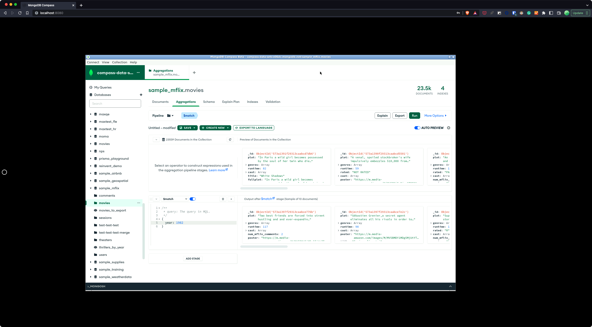

# Dockerized MongoDB Compass (unofficial)

This repo contains a `Dockerfile` and `docker-compose.yml` files to run MongoDB Compass
in a containerized environment accessible through a web browser using [Apache Guacamole](https://guacamole.apache.org/).

The setup is inspired by what the [Linuxserver](https://github.com/linuxserver) folks have been doing for other desktop software.



By default, the image uses Compass 1.34 Beta but the configuration can be tweaked via `ARG`s.

## How to run it

Start the server with:

```
$ docker-compose-up
```

Then open your browser at http://localhost:8080.

## Auto-connect

If the `data` directory contains a file `connection-string.txt` with a MongoDB connection string on a single line, when the environment starts,
Compass will be launched and will automatically connect to the given cluster.